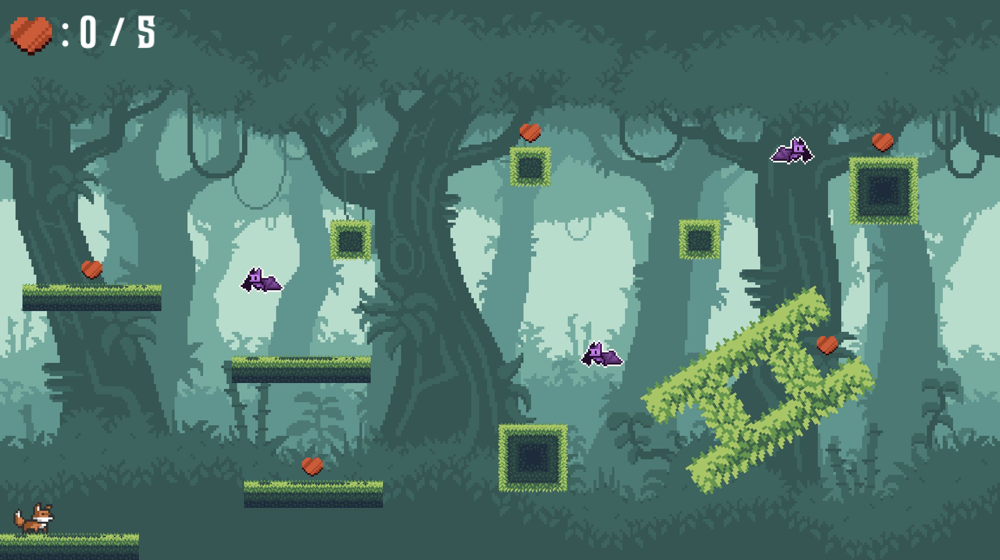

# Fox Platformer

This is my first attempt at making a very simple game in Godot! This game was made as part of my work for the class Bits and Bytes at the University of Virginia. 

In the game, you play as a person who has been turned into a fox by an evil vampire wizard! You must collect all of the
hearts to win back your humanity! BUT! beware of the bats...
